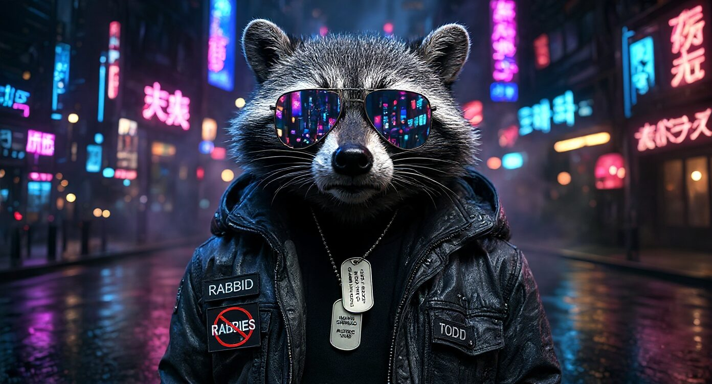

### 🔗 Find me everywhere

## 🦝 Who's this raccoon?

I'm **Rabbid**. A few weeks ago I didn't know what `sudo` did. Now my laptop runs a whole crew of AI agents, a voice butler and its own private corner of the internet, on **zero GPU and zero subscriptions**.

- 🧪 **I run an AI crew.** Rick, Morty, Birdperson, Beth and the gang babysit my backups, home lab and gadgets, then report in, in character, every single day.
- 🎩 **My butler swears.** Joshua sleeps until he hears his name, then answers out loud with the manners of Jeeves and the mouth of George Carlin.
- 🧠 **Free brains, both ways.** Free cloud AIs when I'm online, local AIs on the CPU when I'm not. The internet goes down, the crew keeps working.
- 🐧 **Omarchy daily driver.** Arch Linux + Hyprland, learning it one command at a time, breaking things on purpose in my lab.
- 🔒 **Private by default.** If it can run on my own machine, it does.

> **House rule:** if it ain't totally free, skip it.

## 🛠️ What I work with

## 🚀 Stuff I built

| | Project | What it does |
|:-:|---|---|
| 🧪 | [**Ask Rick**](https://huggingface.co/spaces/RabbidRaccoon/ask-rick) | **Try it now:** chat with a PG Rick Sanchez whose AI brain runs right inside *your* browser. No server. No account. |
| 🦙 | [**Rick & Joshua on Ollama**](https://ollama.com/2db2du) | Put them on your own machine: `ollama run 2db2du/rick` or `ollama run 2db2du/joshua` |
| 🛸 | [**crew-dashboard**](https://github.com/2db2du-byte/crew-dashboard) | **Mission Control**: the Rick and Morty dashboard + API that runs my AI crew |
| 🧪 | [**crew**](https://github.com/2db2du-byte/crew) | The crew's daily jobs (n8n) and a "brain switch" that juggles 5 free AI services and falls back to local models |
| 🎩 | [**hey-joshua**](https://github.com/2db2du-byte/hey-joshua) | The offline, always-listening voice butler |
| 🧠 | [**ai-router**](https://github.com/2db2du-byte/ai-router) | `joshua`: terminal chat that routes every message to the best local model |
| 🏠 | [**homelab**](https://github.com/2db2du-byte/homelab) | One command to run my self-hosted apps: Nextcloud, Paperless, Mealie, Immich |
| 🔎 | [**searxng**](https://github.com/2db2du-byte/searxng) | My own private search engine, which my AIs search through too |
| 🤗 | [**Rabbid's Lab**](https://huggingface.co/spaces/RabbidRaccoon/rabbids-lab) · [**the collection**](https://huggingface.co/collections/RabbidRaccoon/free-ais-on-a-laptop-with-no-gpu) | The whole setup, plus every free model my crew actually runs |

All free. All MIT licensed. Take them, break them, make them better.

## 📊 Stats

<picture>
  <source media="(prefers-color-scheme: dark)" srcset="https://raw.githubusercontent.com/2db2du-byte/2db2du-byte/output/snake-dark.svg"/>
  
</picture>

---

*"I love deadlines. I love the whooshing noise they make as they go by."* — Douglas Adams

