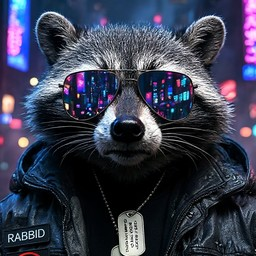

## 🦝 About me

- 🐧 I run **[Omarchy](https://omarchy.org)** (Arch Linux + Hyprland) and I'm teaching myself Linux, one command at a time
- 🤖 I keep a whole **crew of AI helpers** (Rick, Morty, Summer, Birdperson…) that check my backups, home lab and devices and report back every day
- 🆓 House rule: **if it ain't totally free, skip it**. Free cloud AIs when I'm online, local AIs when I'm not
- 🎩 I talk to **Joshua**, my offline voice butler: Jeeves manners, George Carlin mouth
- 🧪 I test wild ideas on cheap, spare hardware before building them for real
- 🔒 Private, local and self-hosted beats someone else's cloud

## 🛠️ What I work with

## 🚀 Things I've built

| | Project | What it does |
|:-:|---|---|
| 🛸 | [**crew-dashboard**](https://github.com/2db2du-byte/crew-dashboard) | **Mission Control**: a Rick and Morty themed dashboard + API for my home AI crew |
| 🧪 | [**crew**](https://github.com/2db2du-byte/crew) | The crew's scheduled jobs (n8n) and a "brain switch": free cloud AIs online, local AIs offline |
| 🎩 | [**hey-joshua**](https://github.com/2db2du-byte/hey-joshua) | An offline, always-listening voice butler with a British accent and a Carlin mouth |
| 🧠 | [**ai-router**](https://github.com/2db2du-byte/ai-router) | `joshua`: terminal chat that sends every message to the best local AI model |
| 🏠 | [**homelab**](https://github.com/2db2du-byte/homelab) | One command to run self-hosted apps (Nextcloud, Paperless, Mealie…) |
| 🔎 | [**searxng**](https://github.com/2db2du-byte/searxng) | My own private search engine, started on demand |

All free, all MIT licensed. Take them, break them, make them better.

## 📊 Stats

<picture>
  <source media="(prefers-color-scheme: dark)" srcset="https://raw.githubusercontent.com/2db2du-byte/2db2du-byte/output/snake-dark.svg"/>
  
</picture>

---

*"I love deadlines. I love the whooshing noise they make as they go by."* — Douglas Adams

